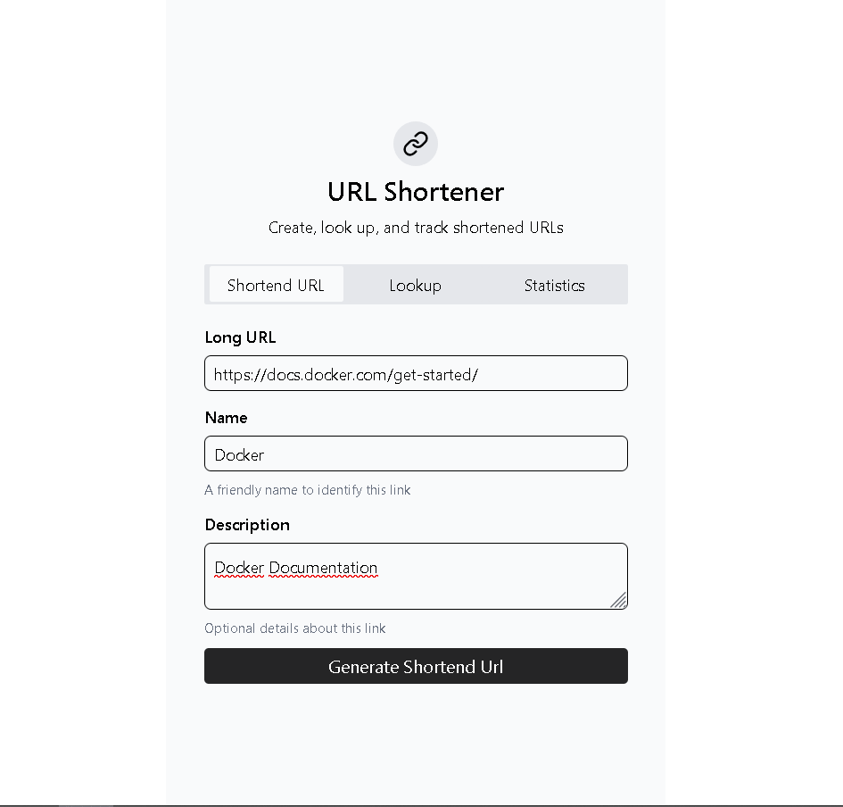

# URL Shortend UI



Frontend built with React, TypeScript, and Vite for the URL Shortend project.

## Requirements

- Node.js 20+
- pnpm (or npm/yarn)

## Environment Variables

Create a `.env` file in the `ui/url-shortend-ui/` directory with the following variable:

```env
VITE_SERVER_URL=http://localhost:8080
```

> Change the value according to your backend server URL.

## Scripts

- `pnpm dev` — Start the development server
- `pnpm build` — Build the app for production
- `pnpm preview` — Preview the production build
- `pnpm lint` — Lint the code

